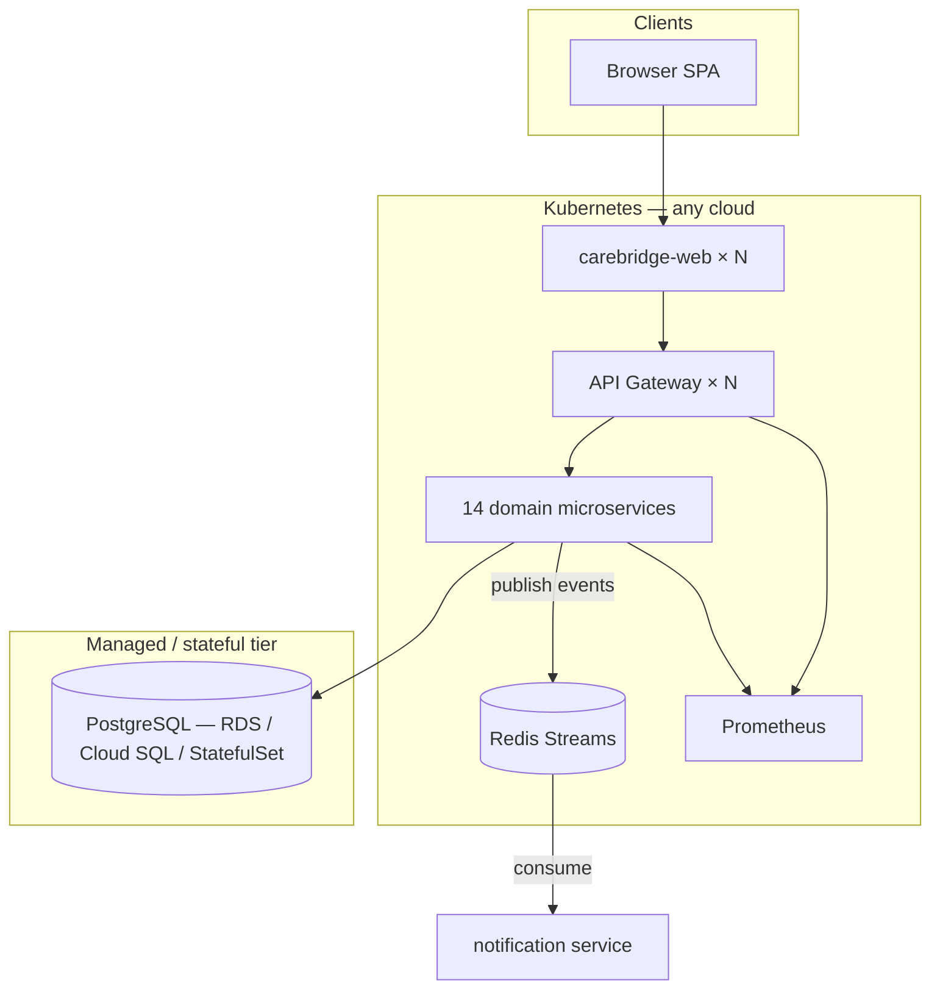

# CareBridge AI — Cloud-Native Architecture

This document explains how CareBridge satisfies cloud-native grading criteria: **microservices**, **event-driven** patterns, **IaC**, **observability**, **portability**, **resilience**, **scalability**, **security**, and **cost efficiency**.

## System overview



| Layer | Technology | Cloud-native principle |
|-------|------------|------------------------|
| Frontend | React + Nginx container | Stateless, horizontally scalable |
| API | Express gateway + 14 services | Microservices, single responsibility |
| Events | Redis Streams | Async, loosely coupled |
| Data | PostgreSQL | Stateful tier isolated from compute |
| Orchestration | Kubernetes + Kustomize + Helm | Declarative, portable |
| IaC | Terraform (EKS/AKS/GKE modules) | Reproducible multi-cloud |
| Observability | Prometheus `/metrics`, health aggregation | Operability |

## Design decisions (explicit reasoning)

### 1. Microservices by domain boundary

Services map to bounded contexts (`auth`, `case`, `ai-chat`, …). **Why:** AI workloads (`ai-chat`, `ai-insights`) have different CPU/memory profiles than CRUD services — independent scaling avoids over-provisioning the whole API.

**Local/dev:** `start-all.mjs` runs all processes in one container (fast iteration).  
**Production/K8s:** Each service is a separate Deployment with its own Service — true microservice deployment.

### 2. API Gateway pattern

`gateway/server.js` is the single north-south entry point. **Why:** Centralizes auth header forwarding, circuit breaking, and dependency health checks without coupling the React app to 14 backend URLs.

Service discovery uses env vars (`AUTH_SERVICE_HOST=carebridge-auth`) — works on Docker Compose (`127.0.0.1`) and Kubernetes (cluster DNS) without code changes.

### 3. Event-driven notifications

Domain writes (`assigned_workers`, `reassignment_requests`, `consultation_requests`, `youth_free_slots`, `offline_counselling_sessions`, crisis from `ai-chat`) publish to **Redis Streams** via `lib/eventBus.js`. The `notification` service consumes asynchronously.

**Why:** Decouples case management from notification delivery; absorbs traffic spikes; enables future subscribers (email, push) without changing producers.

Fallback: in-memory bus when `REDIS_URL` is unset (local dev without Redis).

### 4. Resilience

| Mechanism | Implementation |
|-----------|----------------|
| Health probes | K8s liveness/readiness on every service `/health` |
| Aggregated health | Gateway probes all downstream services |
| Circuit breaker | `lib/circuitBreaker.js` — opens after 5 failures, 30s cooldown |
| Timeouts | Proxy timeout 120s for AI routes |
| Graceful degradation | 503 with `circuit: open` when upstream unhealthy |

### 5. Scalability & autoscaling

`HorizontalPodAutoscaler` on:
- `carebridge-web` (2–10 replicas, CPU 70%)
- `carebridge-gateway` (2–8)
- `carebridge-ai-chat`, `carebridge-ai-insights` (AI burst scaling)

Stateless services scale horizontally; PostgreSQL uses managed RDS/Cloud SQL in production (connection pooling via PgBouncer recommended at scale).

### 6. Portability & multi-cloud

Same artifacts deploy to **Docker Desktop K8s**, **Minikube**, **EKS**, **AKS**, **GKE**:

- Container images (`carebridge-ai:local`, `carebridge-backend:local`)
- `k8s/` Kustomize manifests
- `helm/carebridge/` chart
- `terraform/` modules per cloud

Only secrets and `DATABASE_URL` / `VITE_API_URL` change per environment.

### 7. Managed database (production)

| Environment | Database |
|-------------|----------|
| Local Compose | Postgres container |
| Local K8s | Postgres StatefulSet (`k8s/postgres.yaml`) |
| AWS prod | RDS PostgreSQL (`terraform/aws/`) |
| Azure prod | Azure Database for PostgreSQL (`terraform/azure/`) |
| GCP prod | Cloud SQL (`terraform/gcp/`) |

**Why managed DB:** Automated backups, patching, failover — compute pods remain ephemeral and replaceable.

### 8. Security

- JWT auth on all data routes (`authMiddleware`)
- Service-to-service key (`SERVICE_API_KEY`) for internal calls
- K8s Secrets for `JWT_SECRET`, `OPENROUTER_API_KEY`, `DATABASE_URL`
- `NetworkPolicy` — default deny ingress, allow only gateway ↔ services ↔ web
- Non-root Nginx container for frontend

### 9. Cost efficiency

- Scale AI services independently (pay for GPT-heavy pods only when needed)
- HPA min replicas = 2 for HA, not over-provisioned static pools
- Redis single replica for dev; ElastiCache/Memorystore in prod only when needed
- Stateless web on small CPU requests (250m) — majority of cost is AI API calls (OpenRouter), not infra

### 10. Observability

Every service exposes:
- `GET /health` — liveness
- `GET /metrics` — Prometheus format (`prom-client`)

Gateway `/health` returns per-dependency status. Prometheus + Grafana in `k8s/monitoring/` (see `OBSERVABILITY.md` for example queries).

### 11. CI/CD

GitHub Actions (`.github/workflows/ci.yml`):
- Frontend `npm run build`
- Backend `npm run test:integration`
- `docker compose build`
- Publish to GHCR on `main` / `lifei` push

## Repository map

```
dell/
├── ARCHITECTURE.md          ← this file
├── docker-compose.yml       ← full stack local (postgres, redis, api, web)
├── Dockerfile.backend       ← backend image (one image, many entrypoints)
├── backend/
│   ├── gateway/             ← API gateway
│   ├── services/            ← 14 microservices
│   └── lib/
│       ├── eventBus.js      ← Redis Streams
│       ├── circuitBreaker.js
│       ├── metrics.js       ← Prometheus
│       └── serviceHosts.js  ← K8s DNS discovery
├── k8s/                     ← Kustomize (production-like)
├── helm/carebridge/         ← Helm chart (multi-cloud packaging)
└── terraform/               ← EKS / AKS / GKE + managed DB
```

## Deployment paths

| Goal | Command |
|------|---------|
| Local dev | `cd backend && npm run start:all` + `npm run dev` |
| Docker Compose | `docker compose up -d --build` |
| Kubernetes | `.\scripts\k8s-deploy.ps1` |
| Helm | `helm upgrade --install carebridge ./helm/carebridge -n carebridge --create-namespace` |
| AWS | `cd terraform/aws && terraform apply` |

## Rubric mapping

| Criterion | Evidence |
|-----------|----------|
| Microservices | 14 services + gateway, separate K8s Deployments |
| Event-driven | Redis Streams, `youth.assigned` events |
| IaC | `k8s/`, `helm/`, `terraform/` |
| Observability | Prometheus, Grafana, `/metrics`, aggregated `/health` |
| CI/CD | GitHub Actions build + test + Docker publish |
| Autoscaling | HPA on web, gateway, AI services |
| Managed DB | Terraform RDS + K8s StatefulSet for dev |
| Resilience | Circuit breaker, probes, NetworkPolicy |
| Multi-cloud | Same Helm/K8s on EKS/AKS/GKE |
| Security | JWT, Secrets, NetworkPolicy |
| Cost reasoning | Section 9 above |
